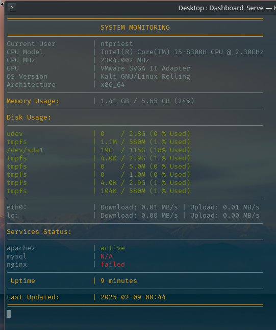

# Dashboard_Server

  A simple, lightweight Bash script for server monitoring. It allows users to track basic system information such as CPU, memory, disk usage, service status, uptime, network, and GPU. The script is fully customizable, enabling users to modify service filters and monitoring settings by editing the code. It doesn’t require external programs, only built-in tools like ```awk```, ```grep```, ```sed```, ```fd```, ```free``` and ```systemctl```. Additionally, it logs server data to a file without consuming significant system resources.

## Screenshots:


## 1. Run:
 ### Permission access:
 
  ```chmod +x Dashboard_Server.sh  ```
### Execute:
  
  ```./Dashboard_Server.sh ```
  
## 2. Configuration [add next service]:
  
  Basic services are: ```apache2```, ```mysql```, ```nginx``` but you can add your own [ex: tor-service etc.].
  
  Add service name of yours (without misspelling) into ```services``` variable/array:
  
  ```services=("apache2" "mysql" "nginx" "<YourNextService>") ``` 
  
## Features:
  * Monitors system resources (CPU, RAM, disk, services, network, GPU).
  * Customizable filters and parameters.
  * Logs monitoring data into a single file.
  * Lightweight with minimal memory usage.
  * Supports easy modification and configuration to fit individual needs.
  * Color-coded output for easy interpretation of system status.
  * No external dependencies—only built-in tools like: ```awk```, ```grep```, ```sed```, ```fd```, ```free``` and ```systemctl``` are required.

## Benefits:
  * Simple to use and configure.
  * Optimized for low memory usage.
  * Easy to modify and adapt.
  * Consolidates logs into a single file for historical tracking ```Log.txt```.
    
## Requirements:
  Linux/Unix system with access to ```awk```, ```sed```, ```grep```, ```df```, ```free```, ```systemctl```, etc.

Use Case: Ideal for system administrators, server managers, or anyone looking for a lightweight and easy-to-use server monitoring solution without needing to install extra software.

(Just... don’t look too closely at the awk filters, I’m not sure what’s going on there either)

## License:
This project is licensed under the [Creative Commons Attribution-NonCommercial 4.0 International (CC BY-NC 4.0)](LICENSE.txt).  
You are free to share and adapt the material, but only for non-commercial purposes and with proper attribution.
